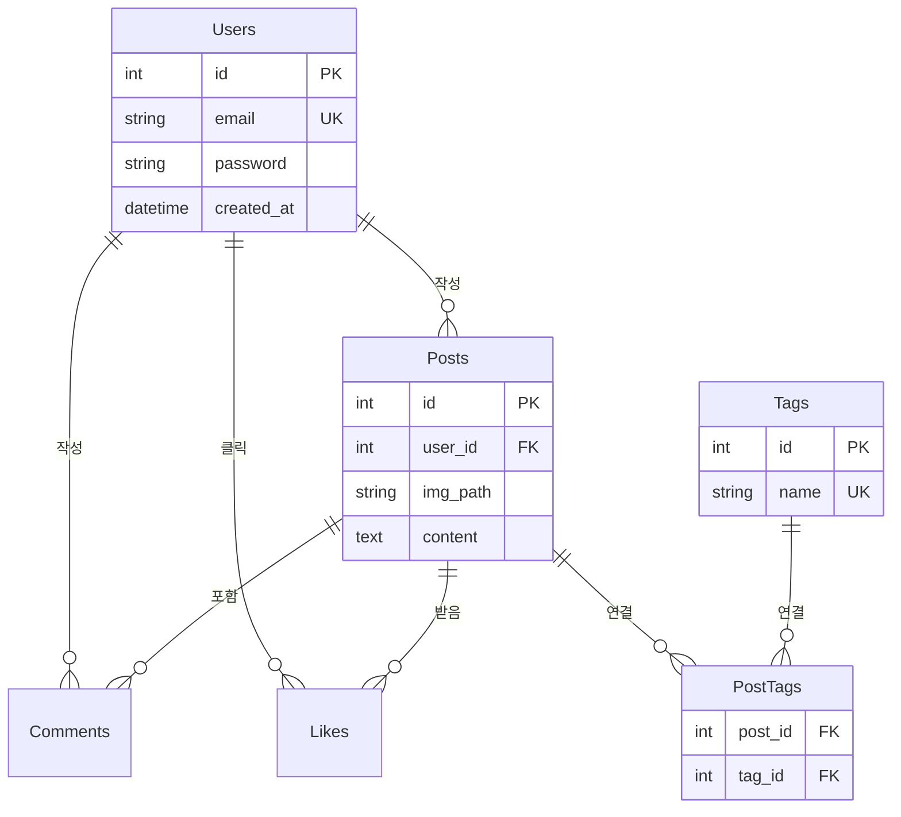

# Antigravity Web Dev Workshop: MyStaGram Project

본 프로젝트는 **Antigravity를 이용한 웹 개발 워크숍**을 위해 생성된 결과물입니다.
사용자는 이 프로젝트를 통해 웹 애플리케이션의 기본 구조(Frontend/Backend)와 데이터베이스 연동, 그리고 태그 검색과 같은 심화 기능을 학습할 수 있습니다.

## 1. 프로젝트 개요
*   **프로젝트명**: MyStaGram (구 Insta-Lite)
*   **목표**: 사진 공유, 댓글, 좋아요, 태그 검색이 가능한 경량 SNS 서비스 구현
*   **기술 스택**:
    *   **Backend**: Python (FastAPI), SQLite
    *   **Frontend**: HTML, CSS, Vanilla JavaScript
    *   **Environment**: `uv` (Python Package Manager)

## 2. 실행 방법 (How to Run)

이 프로젝트는 `uv`를 사용하여 의존성을 관리합니다.

```bash
# 1. 저장소 복제 (또는 다운로드)
git clone <repository-url>
cd <repository-directory>

# 2. 가상환경 생성 및 의존성 설치
uv sync

# 3. 서버 실행
uv run uvicorn app.main:app --host 0.0.0.0 --port 8000 --reload
```
서버가 실행되면 브라우저에서 `http://localhost:8000`으로 접속하세요.

## 3. 코드 구조 (Code Structure)

```
.
├── app/
│   ├── main.py          # FastAPI 앱 진입점 (설정 및 라우터 등록)
│   ├── database.py      # DB 연결 및 테이블 생성
│   ├── models.py        # Pydantic 데이터 모델
│   └── routers/         # API 기능별 분리
│       ├── auth.py      # 로그인/회원가입
│       ├── posts.py     # 게시물 CRUD
│       ├── comments.py  # 댓글
│       ├── likes.py     # 좋아요
│       └── tags.py      # 태그 검색 (New!)
├── static/              # 정적 파일 (CSS, JS, 업로드 이미지)
├── templates/           # HTML 템플릿
└── data/                # SQLite 데이터베이스 파일 저장소
```

## 4. 데이터베이스 스키마 (ERD)

이 프로젝트는 `Users`, `Posts`, `Comments`, `Likes` 그리고 태그 기능을 위한 `Tags`, `PostTags` 테이블로 구성됩니다.



---
**Generated by Google Antigravity** following Q's guidelines.
