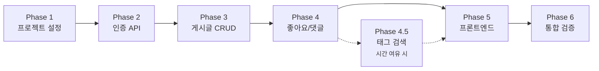

# Insta-Lite 구현 계획서

PRD 문서를 기반으로 3시간 워크숍용 경량 인스타그램 앱을 구현합니다.

## User Review Required

> [!IMPORTANT]
> 이 프로젝트는 **3시간 내 완성**을 목표로 하므로, P0(필수) → P1(보조) → P2(선택) 순서로 구현합니다.
> P2(태그 검색)는 시간 여유 시에만 구현합니다.

---

## Proposed Changes

### 프로젝트 구조

```
/Users/yoonani/Workshop/Web_dev_ws/
├── app/
│   ├── __init__.py
│   ├── main.py              # FastAPI 앱 엔트리포인트
│   ├── config.py            # 설정 (SECRET_KEY, DB 경로 등)
│   ├── database.py          # SQLite 연결 및 초기화
│   ├── models.py            # Pydantic 스키마 정의
│   ├── auth.py              # JWT 인증 유틸리티
│   └── routers/
│       ├── __init__.py
│       ├── auth.py          # 회원가입/로그인 API
│       ├── posts.py         # 게시글 CRUD API
│       ├── likes.py         # 좋아요 API
│       ├── comments.py      # 댓글 API
│       └── tags.py          # 태그 검색 API (P2)
├── static/
│   ├── css/
│   │   └── style.css        # 공통 스타일
│   ├── js/
│   │   └── app.js           # 프론트엔드 로직
│   └── uploads/             # 이미지 업로드 저장소
├── templates/
│   ├── index.html           # 메인 피드
│   ├── login.html           # 로그인
│   ├── register.html        # 회원가입
│   └── post_detail.html     # 게시글 상세
├── data/
│   └── insta.db             # SQLite 데이터베이스 파일
└── pyproject.toml           # 의존성 정의
```

---

### Phase 1: 프로젝트 설정

#### [MODIFY] [pyproject.toml](file:///Users/yoonani/Workshop/Web_dev_ws/pyproject.toml)

필요 패키지 추가:
- `fastapi[standard]` - 웹 프레임워크
- `python-multipart` - 파일 업로드 지원
- `bcrypt` - 비밀번호 해싱
- `python-jose[cryptography]` - JWT 토큰 처리

#### [NEW] [app/config.py](file:///Users/yoonani/Workshop/Web_dev_ws/app/config.py)

```python
SECRET_KEY = "your-secret-key"  # 환경변수로 관리 권장
ALGORITHM = "HS256"
ACCESS_TOKEN_EXPIRE_MINUTES = 60
DATABASE_URL = "data/insta.db"
UPLOAD_DIR = "static/uploads"
```

#### [NEW] [app/database.py](file:///Users/yoonani/Workshop/Web_dev_ws/app/database.py)

SQLite 연결 및 테이블 초기화:
- Users, Posts, Comments, Likes, Tags, PostTags 테이블 생성
- 앱 시작 시 자동 마이그레이션

---

### Phase 2: 백엔드 - 인증 시스템 (P0-F1)

#### [NEW] [app/routers/auth.py](file:///Users/yoonani/Workshop/Web_dev_ws/app/routers/auth.py)

| Endpoint | Method | 설명 |
|----------|--------|------|
| `/api/auth/register` | POST | 이메일/비밀번호로 회원가입, bcrypt 해싱 |
| `/api/auth/login` | POST | 로그인 후 JWT 토큰 반환 |

#### [NEW] [app/auth.py](file:///Users/yoonani/Workshop/Web_dev_ws/app/auth.py)

- `create_access_token()` - JWT 생성
- `get_current_user()` - 토큰 검증 dependency

---

### Phase 3: 백엔드 - 게시글 CRUD (P0-F2, F3, F4)

#### [NEW] [app/routers/posts.py](file:///Users/yoonani/Workshop/Web_dev_ws/app/routers/posts.py)

| Endpoint | Method | 인증 | 설명 |
|----------|--------|------|------|
| `/api/posts` | GET | ❌ | 전체 게시물 조회 (최신순) |
| `/api/posts` | POST | ✅ | 게시물 작성 (이미지 + 본문) |
| `/api/posts/{id}` | GET | ❌ | 게시물 상세 조회 |
| `/api/posts/{id}` | PUT | ✅ | 수정 (작성자만 가능) |
| `/api/posts/{id}` | DELETE | ✅ | 삭제 (작성자만 가능) |

```python
# 권한 검증 예시
def verify_owner(post_user_id: int, current_user_id: int):
    if post_user_id != current_user_id:
        raise HTTPException(403, "권한이 없습니다")
```

---

### Phase 4: 백엔드 - 좋아요/댓글 (P1-F5)

#### [NEW] [app/routers/likes.py](file:///Users/yoonani/Workshop/Web_dev_ws/app/routers/likes.py)

| Endpoint | Method | 설명 |
|----------|--------|------|
| `/api/posts/{id}/like` | POST | 좋아요 토글 (있으면 취소, 없으면 추가) |

#### [NEW] [app/routers/comments.py](file:///Users/yoonani/Workshop/Web_dev_ws/app/routers/comments.py)

| Endpoint | Method | 설명 |
|----------|--------|------|
| `/api/posts/{id}/comments` | POST | 댓글 작성 |
| `/api/posts/{id}/comments` | GET | 댓글 목록 조회 |

---

### Phase 5: 백엔드 - 태그 검색 (P2-F6)

#### [NEW] [app/routers/tags.py](file:///Users/yoonani/Workshop/Web_dev_ws/app/routers/tags.py)

| Endpoint | Method | 설명 |
|----------|--------|------|
| `/api/tags/{tag_name}` | GET | 태그별 게시물 필터링 |

게시물 작성 시 본문에서 `#태그` 추출하여 Tags/PostTags 테이블에 저장.

---

### Phase 6: 프론트엔드 개발

#### [NEW] [templates/](file:///Users/yoonani/Workshop/Web_dev_ws/templates/) 디렉토리

| 파일 | 설명 |
|------|------|
| `index.html` | 메인 피드 - 카드형 게시물 목록, 글쓰기 버튼 |
| `login.html` | 로그인 폼 |
| `register.html` | 회원가입 폼 |
| `post_detail.html` | 게시물 상세, 댓글, 수정/삭제 버튼 |

#### [NEW] [static/css/style.css](file:///Users/yoonani/Workshop/Web_dev_ws/static/css/style.css)

MVP 수준의 깔끔한 UI:
- 모바일 우선 반응형 레이아웃
- 카드 컴포넌트
- 버튼 스타일

#### [NEW] [static/js/app.js](file:///Users/yoonani/Workshop/Web_dev_ws/static/js/app.js)

- API 호출 함수 (fetch)
- 로그인 상태 관리 (localStorage에 JWT 저장)
- DOM 조작 (게시물 렌더링)

---

## Verification Plan

### 자동 테스트

```bash
# 서버 실행 (백그라운드)
cd /Users/yoonani/Workshop/Web_dev_ws
source .venv/bin/activate
uv run uvicorn app.main:app --reload --host 0.0.0.0 --port 8000
```

### 수동 검증 - 인수 조건(DoD) 체크리스트

브라우저에서 `http://localhost:8000` 접속 후:

| # | 테스트 항목 | 검증 방법 |
|---|------------|----------|
| 1 | 회원가입 후 로그인 | 새 이메일로 가입 → 로그인 성공 확인 |
| 2 | 이미지 업로드 | 사진 업로드 → 서버 `static/uploads/` 폴더에 파일 생성 확인 |
| 3 | 수정/삭제 권한 | 본인 글에만 수정/삭제 버튼 표시, 타인 글에는 비활성 |
| 4 | 좋아요 토글 | 좋아요 클릭 → 숫자 증가, 재클릭 → 숫자 감소 |
| 5 | 댓글 작성 | 댓글 입력 → 게시물 하단에 표시 |
| 6 | 태그 검색 (P2) | `#여행` 검색 → 관련 게시물만 필터링 |

### API 테스트 (FastAPI Swagger UI)

```
http://localhost:8000/docs
```

Swagger UI에서 각 엔드포인트 직접 테스트 가능.

---

## 구현 순서 요약


