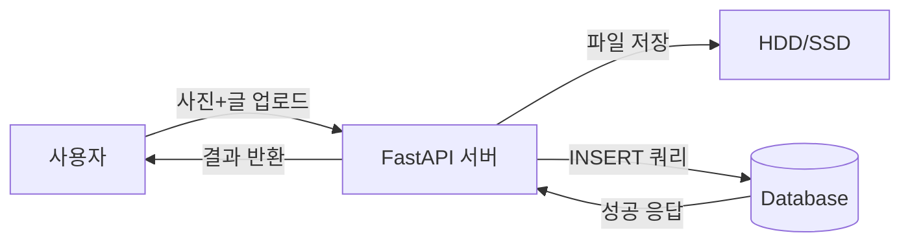
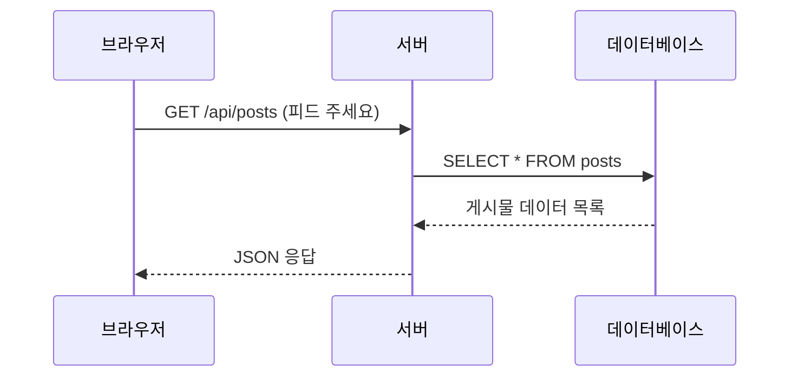
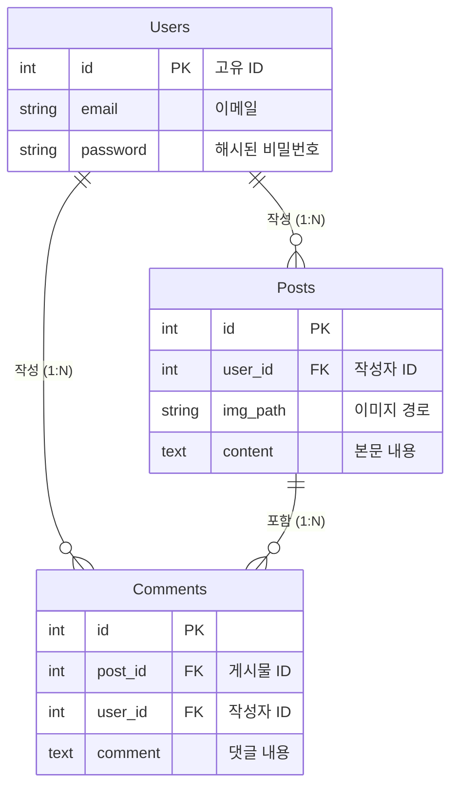

# 웹 개발의 핵심: CRUD 구현 원리 (MyStaGram 코드 예시)

이 문서는 **MyStaGram** 프로젝트의 실제 코드를 통해 웹 애플리케이션의 가장 기본이 되는 **CRUD (Create, Read, Update, Delete)** 기능이 어떻게 구현되고 데이터베이스에 저장되는지 설명합니다.

## 1. CRUD와 HTTP 메서드
웹 개발에서 데이터 처리는 주로 4가지 동작으로 나뉩니다. 이를 HTTP 메서드와 매핑하여 구현합니다.

| 동작 (CRUD) | 의미 | HTTP 메서드 | SQL 명령어 | MyStaGram 기능 |
|---|---|---|---|---|
| **C**reate | 생성 | `POST` | `INSERT` | 게시물 작성, 회원가입 |
| **R**ead | 조회 | `GET` | `SELECT` | 피드 보기, 상세 보기 |
| **U**pdate | 수정 | `PUT` / `PATCH` | `UPDATE` | 게시물 수정 |
| **D**elete | 삭제 | `DELETE` | `DELETE` | 게시물 삭제 |

---

## 2. 상세 구현 분석

### 2.1. Create (게시물 작성)

사용자가 사진과 글을 올리면 서버는 **1) 이미지 파일을 저장**하고 **2) 파일 경로와 내용을 DB에 저장**합니다.

**코드 예시 (`app/routers/posts.py`):**
```python
@router.post("/")
async def create_post(content: str = Form(...), file: UploadFile = File(...), ...):
    # 1. 이미지 파일 서버에 저장
    file_name = f"{uuid.uuid4()}.{file.filename.split('.')[-1]}"
    with open(f"static/uploads/{file_name}", "wb") as buffer:
        shutil.copyfileobj(file.file, buffer)
    
    # 2. 데이터베이스에 정보 저장 (파일 경로 + 내용)
    cursor.execute(
        "INSERT INTO posts (user_id, img_path, content) VALUES (?, ?, ?)",
        (current_user.user_id, f"/static/uploads/{file_name}", content)
    )
    conn.commit()
```

**데이터 흐름도:**


### 2.2. Read (피드 조회)

저장된 데이터를 최신순으로 불러와 화면에 보여줍니다.

**코드 예시 (`app/routers/posts.py`):**
```python
@router.get("/")
async def read_posts():
    # DB에서 모든 게시물을 작성일(created_at) 역순으로 조회
    cursor.execute("SELECT * FROM posts ORDER BY created_at DESC")
    posts = cursor.fetchall()
    return posts
```

**시퀀스 다이어그램:**


### 2.3. Update (게시물 수정)

**작성자 본인인지 확인**한 후 내용을 변경합니다.

**코드 예시 (`app/routers/posts.py`):**
```python
@router.put("/{post_id}")
async def update_post(post_id: int, content: str, ...):
    # 1. 작성자 확인
    if post["user_id"] != current_user.user_id:
        raise HTTPException(status_code=403, detail="권한이 없습니다")
    
    # 2. 내용 수정 및 수정시간 업데이트
    cursor.execute(
        "UPDATE posts SET content = ?, updated_at = CURRENT_TIMESTAMP WHERE id = ?",
        (content, post_id)
    )
    conn.commit()
```

### 2.4. Delete (게시물 삭제)

데이터베이스에서 해당 데이터를 영구적으로 제거합니다.

**코드 예시 (`app/routers/posts.py`):**
```python
@router.delete("/{post_id}")
async def delete_post(post_id: int, ...):
    # 작성자 확인 후 삭제
    cursor.execute("DELETE FROM posts WHERE id = ?", (post_id,))
    conn.commit()
```

---

## 3. 데이터베이스 스키마 (ERD)

MyStaGram의 데이터가 어떻게 구조화되어 있는지 보여주는 다이어그램입니다.



---
**Generated by Google Antigravity** following Q's guidelines.
