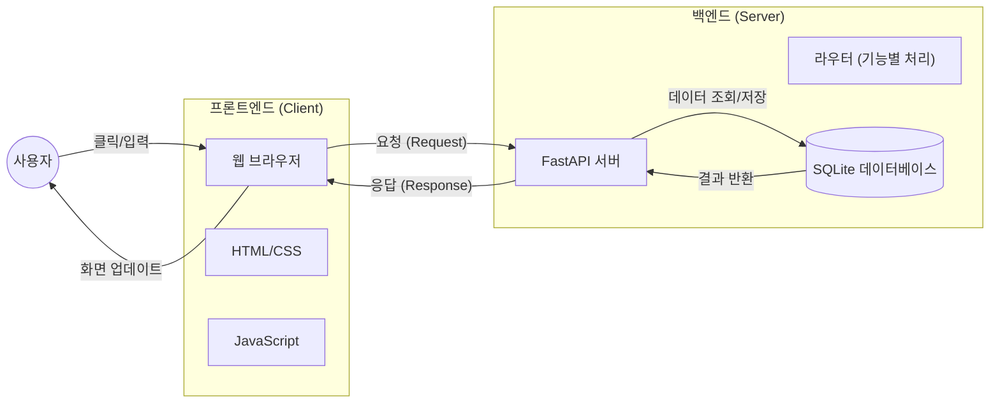

# 웹 개발 입문 가이드: MyStaGram 프로젝트 해설

이 문서는 **MyStaGram** 프로젝트 코드를 통해 웹 개발의 기초 개념인 **프론트엔드(Frontend)**와 **백엔드(Backend)**의 역할과 구현 방식을 설명합니다.

## 목차
1. [웹 애플리케이션의 전체 구조](#1-웹-애플리케이션의-전체-구조)
2. [프론트엔드 (Frontend): 사용자가 보는 화면](#2-프론트엔드-frontend-사용자가-보는-화면)
3. [백엔드 (Backend): 데이터와 로직 처리](#3-백엔드-backend-데이터와-로직-처리)
4. [기능으로 보는 데이터 흐름 (예: 로그인)](#4-기능으로-보는-데이터-흐름-예-로그인)

---

## 1. 웹 애플리케이션의 전체 구조

웹 개발은 크게 **보여주는 부분(Frontend)**과 **처리하는 부분(Backend)**으로 나뉩니다. 두 부분은 **API**라는 약속된 규칙을 통해 대화합니다.



---

## 2. 프론트엔드 (Frontend): 사용자가 보는 화면

프론트엔드는 사용자가 웹 브라우저를 통해 직접 보고 상호작용하는 영역입니다. 이 프로젝트에서는 `templates/`와 `static/` 폴더가 이 역할을 담당합니다.

### 2.1. 구성 요소

| 기술 | 역할 | 프로젝트 내 위치 | 비유 |
|---|---|---|---|
| **HTML** | 웹 페이지의 **뼈대와 구조**를 잡습니다. | `templates/*.html` | 건물의 기둥과 벽 |
| **CSS** | 화면을 **예쁘게 꾸밉니다** (색상, 배치). | `static/css/style.css` | 인테리어, 페인트 |
| **JavaScript** | 사용자의 행동에 **반응하고 동작**합니다. | `static/js/app.js` | 전기, 수도, 수도꼭지 |

### 2.2. 주요 코드 설명

**화면 그리기 (HTML + Jinja2):**
이 프로젝트는 `Jinja2` 템플릿 엔진을 사용하여 서버에서 HTML 파일을 클라이언트로 보냅니다.
하지만, 실제 '앱' 같은 동작(좋아요 누르기, 로딩 없이 데이터 가져오기)은 JavaScript가 담당합니다.

**서버와 대화하기 (JavaScript `fetch`):**
`static/js/app.js`에 있는 `api` 객체는 백엔드 서버에 데이터를 요청하는 우체부 역할을 합니다.

```javascript
// 예: 서버에 데이터 요청하기 (Frontend)
async function request(url, options) {
    // ... JWT 토큰(출입증)을 헤더에 붙임 ...
    const response = await fetch(url, options); // 서버로 요청 발송!
    return response;
}
```

---

## 3. 백엔드 (Backend): 데이터와 로직 처리

백엔드는 눈에 보이지 않지만, 사용자의 요청을 받아 데이터를 저장하거나 꺼내주는 **서버의 두뇌** 역할을 합니다. `app/` 폴더가 이 역할을 담당합니다.

### 3.1. 구성 요소

| 기술/모듈 | 역할 | 프로젝트 내 위치 | 설명 |
|---|---|---|---|
| **FastAPI** | 요청을 가장 먼저 받는 **현관문** | `app/main.py` | Python 기반의 고성능 웹 프레임워크 |
| **Routers** | 요청을 종류별로 분류하는 **안내 데스크** | `app/routers/` | 기능별(로그인, 글쓰기 등)로 코드를 나눔 |
| **Models** | 데이터의 **형식(규격)**을 정의 | `app/models.py` | 이메일은 문자열, 나이는 숫자 등 규칙 정의 |
| **Database** | 데이터를 영구히 **저장하는 창고** | `data/insta.db` | 엑셀 시트처럼 회원정보, 글 등을 저장 |

### 3.2. 주요 동작 방식

**요청 받기 (Router):**
사용자가 `/api/posts` 주소로 요청을 보내면, `posts.py`에 있는 함수가 실행됩니다.

```python
# 예: 게시물 목록 달라는 요청 처리 (Backend)
@router.get("/") 
async def read_posts():
    # 1. 데이터베이스 접속
    conn = get_db_connection()
    # 2. SQL(데이터베이스 언어)로 게시물 조회
    cursor.execute("SELECT * FROM posts ...") 
    # 3. 결과 반환
    return posts 
```

---

## 4. 기능으로 보는 데이터 흐름 (예: 로그인)

로그인 버튼을 눌렀을 때 프론트엔드와 백엔드가 어떻게 협력하는지 살펴봅시다.

1.  **[Frontend] 사용자 입력**: 사용자가 이메일/비밀번호 입력 후 '로그인' 클릭
2.  **[Frontend] 요청 발송**: `app.js`가 입력된 정보를 가지고 `POST /api/auth/login` 주소로 요청을 보냄.
3.  **[Backend] 검증**: `auth.py`가 비밀번호가 맞는지 확인 (해싱된 비밀번호 비교).
4.  **[Backend] 토큰 발급**: 정보가 맞으면 **JWT(JSON Web Token)** 라는 '디지털 출입증'을 발급해 응답.
5.  **[Frontend] 저장**: 받은 토큰을 브라우저의 `localStorage` (브라우저 내부 저장소)에 안전하게 보관.
6.  **[Frontend] 이동**: 메인 페이지로 이동. 이후 모든 요청마다 이 토큰을 보여주며 "나 로그인한 사람이야"라고 증명함.

---

## 5. 마치며

이 프로젝트(MyStaGram)는 웹 개발의 가장 핵심적인 패턴인 **Client-Server Architecture**를 따르고 있습니다.
이 코드를 수정해보며 학습하려면 다음 순서를 추천합니다:

1.  **HTML/CSS 수정해보기**: 버튼 색깔을 바꾸거나 문구를 수정하며 즉각적인 변화를 느껴보세요.
2.  **API 응답 바꿔보기**: 백엔드에서 반환하는 메시지를 바꿔보세요.
3.  **새로운 기능 추가하기**: '작성자 이름'을 게시물 옆에 띄우는 것부터 시작해보세요.

---
**작성일**: 2026-02-09
**작성자**: Google Antigravity (Requested by User)
